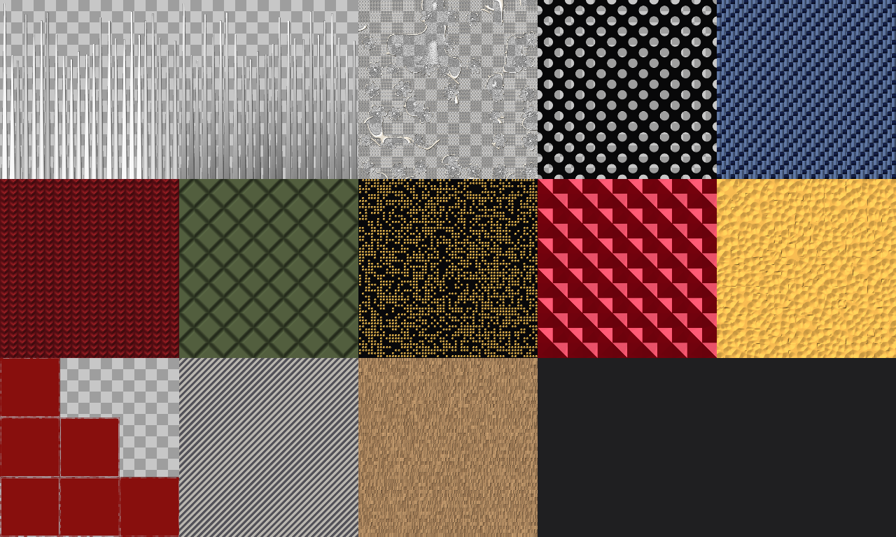
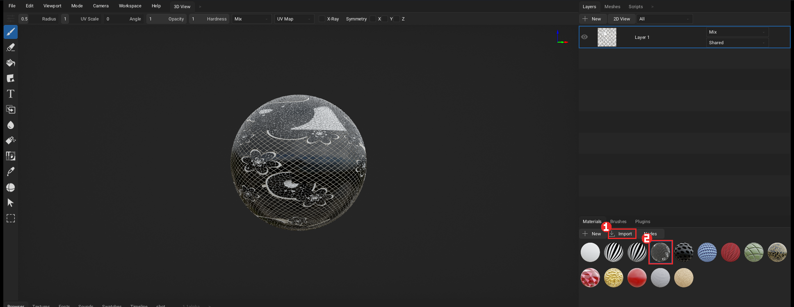
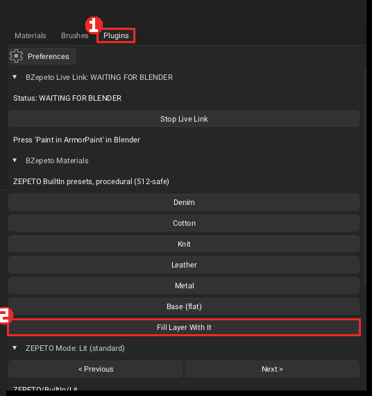
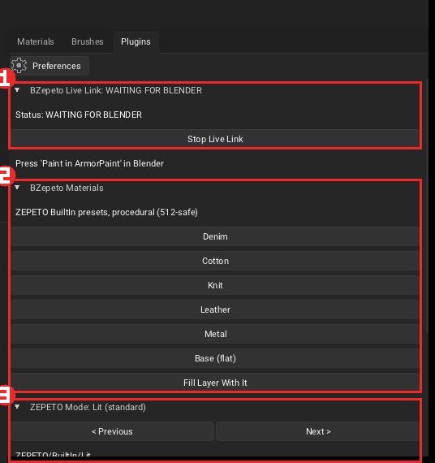

# ArmorPaint

[🇺🇸 English](./armorpaint.md) | 🇰🇷 한국어

그림의 빨간 상자가 누를 곳이고, 번호 순서대로 누르면 됩니다.

## 1. 설치

1. `BZepeto_ArmorPaint_<버전>_win64.zip` 을 **새 폴더**에 풉니다(예: `C:\Tools\BZepeto_ArmorPaint`).
   *Program Files* 아래는 피하세요 — ArmorPaint가 설정을 저장하지 못합니다. 이전 버전 폴더에 덮어쓰거나
   예전 플러그인을 복사하지 마세요
2. `ArmorPaint.exe` 를 한 번 실행해 창이 뜨는지 확인합니다. BZepeto 플러그인은 이미 켜져 있습니다
3. Blender에서 **ArmorPaint Executable** 을 이 `ArmorPaint.exe` 로 지정합니다
   ([Blender 설치](KO_blender.md) 참고)

## 2. ArmorPaint가 처음이라면 — 노드 샘플부터

ArmorPaint 폴더의 **Template** 에 BZepeto 노드 13종의 완성 재질(`.arm`)이 있습니다. 노드가 색·투명도·
높이·금속·거칠기에 제페토 용도대로 이미 연결되어 있습니다. `Template\_Overview.png` 에서 모두 볼 수 있습니다:

**샘플을 아이템에 입히기 (3단계)**

1. `Template` 폴더의 `.arm` 파일을 ArmorPaint 창에 끌어다 놓습니다 — 또는 오른쪽 아래 Materials 패널의
   **Import** **①** 를 눌러 고릅니다
2. Materials 패널에 재질이 생기면 그것을 클릭합니다 **②**

   

3. **Plugins** 탭 **①** 을 열고 **Fill Layer With It** **②** 를 누르면 레이어 전체에 입혀집니다.
   일부만 칠하려면 브러시로 칠하세요

   

**샘플 바꾸기** — 재질을 더블클릭하면 노드가 열립니다. 대부분 *노드 → Mix RGB → Base Color* 구조라,
**Mix RGB** 노드의 두 색만 바꾸면 무늬는 그대로 두고 색만 바뀝니다. BZepeto 노드의 값도 바꿔 보세요:

| 파일 | 제페토 셰이더 | 바꿔 볼 값 |
|---|---|---|
| 01 Hair Strands | HairAlpha | Strands, Taper, Length Variation, Seed |
| 02 Hair Root to Tip | HairAlpha | Root, Tip, Grain |
| 03 Floral Lace | Lit (투명) | Motif Scale, Net Density, Thread, Motifs |
| 04 Lace Mesh | Lit (투명) | Scale, Hole |
| 05 Weave Denim | Cloth | Scale, Pattern(0 평직, 1 능직, 2 수자), Contrast |
| 06 Knit Wool | Cloth | Scale |
| 07 Quilt Puffer | Lit | Scale, Line |
| 08 Sequins | Sparkle | Scale, Density, Seed |
| 09 Gem Facets | CustomEnv | Facets, Scale |
| 10 Hammered Metal | Lit (금속) | Scale |
| 11 Edge Wear | Lit | Amount, Break Up (메쉬 모서리를 읽음 — 평평한 면에는 거의 안 보임) |
| 12 Toon Hatching | Toon | Scale, Angle, Width |
| 13 Fur Strands | Fur | Scale |

- 헤어(01, 02)는 일부러 회색입니다. 앱에서 사용자가 고른 머리색이 곱해집니다
- 레이스(03, 04)는 투명 아이템입니다. ZEPETO Mode 패널에서 **Transparent** 를 켜야 알파가 내보내집니다
- 모든 무늬는 절차적이라 제페토 규격 512px(권장 256px)로 줄여도 또렷합니다

## 3. 모델링하면서 칠하기 (라이브 링크)

1. Blender에서 아이템을 선택하고 **Paint in ArmorPaint**
2. 아이템이 열린 채로 ArmorPaint가 뜨고, Plugins 탭의 **BZepeto Live Link** 패널 **①** 이 **CONNECTED**
   로 바뀝니다(그 전에는 *WAITING FOR BLENDER*)
3. Blender의 **Auto Push** 를 켜 두면 편집을 멈춘 뒤 0.8초 후 다시 전송됩니다 — 칠한 레이어는 남습니다

머티리얼이 없는 아이템은 보낼 때 제페토용 머티리얼이 자동으로 만들어집니다.

**Animated (pose clip)** — Blender ArmorPaint 패널에서 켜면 아이템을 뼈대·액션(예: 제페토 애니메이션
클립)과 함께 보냅니다. ArmorPaint 타임라인을 이음새가 늘어나는 포즈로 옮겨 칠하면 됩니다.

**버텍스 컬러 → Color ID** — ArmorPaint 의 Color ID 도구(**C**)는 버텍스 컬러가 아니라 텍스처를 씁니다.
그래서 Blender ArmorPaint 패널의 **Vertex Colours as Color ID**(기본 켜짐)가 켜져 있으면, **Paint in ArmorPaint**
를 누를 때 아이템의 버텍스 컬러를 Color ID 맵으로 구워 함께 보냅니다. ArmorPaint 가 그 맵을 자동으로
Color ID 맵으로 지정하므로, ArmorPaint 에서 **C** 를 누르고 색 영역을 클릭하면 그 영역 안에만 칠해집니다.
세트 의상(UDIM)은 타일마다 따로 구분됩니다. 버텍스 컬러가 없거나 한 색뿐이면 맵을 만들지 않습니다.

**Color ID 영역에 재질 입히기**
1. **C** 를 누르고 재질을 입힐 색 영역을 클릭합니다(Color ID 화면으로 바뀜)
2. Layers 에서 그 부분 재질 그룹의 `paint` 레이어를 고릅니다
3. Materials 에서 입힐 재질을 고릅니다(클라우드 재질은 Materials 빈 곳에 끌어다 놓아 추가)
4. **채우기 도구**(물통)로 그 영역을 클릭 — 찍은 영역 안에만 재질 전체(색·거칠기·노멀 등)가 들어갑니다.
   브러시로 칠해도 영역 밖으로 나가지 않습니다
5. 다른 영역은 다시 **C** 로 찍으면 됩니다

**세트 의상 (UDIM)** — 상의·하의 재질이 나뉜 아이템은 `아이템.1001`, `아이템.1002` 처럼 타일별 객체로
열립니다. 레이어는 타일마다 따로 칠해지고, 보낼 때 타일마다 텍스처 세트가 나옵니다
(`아이템_base.1001.png` …). Blender 쪽 준비: [세트 의상](KO_blender.md).

**Blender 머티리얼** — Blender에서 쓰던 머티리얼이 같은 이름·색으로 Materials 패널에 생기고, 머티리얼마다
채우기 레이어가 하나씩 만들어집니다(세트 의상이면 자기 타일에만). 처음 열 때 한 번만 만들고, 그다음부터는
칠한 레이어를 건드리지 않습니다.

**레이어 구성** — 재질 하나가 Layers의 **그룹(폴더) 하나**입니다(이름은 재질 이름). 접으면 재질 수만큼만 보이고,
펼치면 안에 `<재질> fill`(재질 색 채우기)과 `<재질> paint`(칠하는 레이어)가 있습니다. 둘 다 그 재질의 타일(메쉬)에만
칠해집니다. 채우기 레이어는 브러시로 칠해지지 않으니(ArmorPaint 규칙) `paint` 레이어에 칠하세요 — 마지막 재질의
`paint` 가 선택된 채로 열립니다. 다른 재질을 칠하려면 그 그룹의 `paint` 를 누르세요.

**브러시 색** — ArmorPaint 는 선택된 **재질**로 칠합니다(Layers **+ New → Paint Layer** 도 같음). 열 때
`Swatch Color` 재질이 선택되어 있어 **Swatches** 에서 고른 색이 그대로 칠해집니다. Materials에서 다른 재질을 고르면
브러시가 그 재질을 칠하니, 다시 색으로 칠하려면 Plugins 탭의 **Brush: Swatch Color** 를 누르세요.

**한 그룹에 재질 섞기** — Materials에서 섞을 재질을 고르고(클라우드 재질은 Materials 빈 곳에 끌어다 놓아 추가),
Layers에서 그 재질 그룹의 레이어를 하나 누른 뒤 Plugins 탭의 **Add Material to Group: <재질>** 을 누르세요. 그룹
안에 그 재질의 fill 레이어가 **검은 마스크**와 함께 생기고 마스크가 선택됩니다. 마스크에 **흰색으로 칠한 곳만** 새
재질이 보이고, 검은색으로 칠하면 다시 가려집니다. 타일 제한도 그룹 것을 그대로 따릅니다.

ArmorPaint 자체 기능도 같은 구조로 만들어집니다. **+ New → Fill Layer**, 재질을 뷰포트나 Layers에 끌어다 놓기,
Materials 우클릭 → **To Fill Layer** 모두:
- **그룹 줄(또는 그룹 밖)을 선택한 상태** → 재질 이름의 새 그룹 + `fill` + `paint`
- **그룹 안의 레이어를 선택한 상태** → 그 그룹에 검은 마스크로 섞기

그룹 안에 새로 만들거나 끌어 넣은 레이어는 그룹의 메쉬(타일)를 자동으로 따라갑니다. 레이어 오른쪽 아래 칸이
`Shared` 면 모든 메쉬에 칠해지는데, 세트 의상 타일들은 UV가 같은 자리에 겹쳐 있어 다른 타일까지 바뀝니다.

**재질 바꾸기 (클라우드·Template)** — 클라우드나 브라우저의 재질을 **Layers의 그 재질 그룹(또는 fill 레이어) 위**나 **Materials의 그
재질 아이콘 위**에 끌어다 놓으면 새로 추가되지 않고 그 재질이 바뀝니다. 이름과 채우기 레이어는 그대로라, 그 재질을
쓰는 부분(세트 의상이면 그 타일)이 한 번에 새 재질로 바뀌고 Blender·Unity로 보낼 때도 같은 이름입니다. 빈 곳에
놓으면 전처럼 새 재질로 추가됩니다.

## 4. BZepeto Materials (스마트 머티리얼)

**BZepeto Materials** 패널 **②**: **Denim, Cotton, Knit, Leather, Metal, Base**. 하나를 누른 뒤
**Fill Layer With It** 으로 채우고 그 위에 칠하면 됩니다. 절차적이라 512px에서도 또렷하고 제페토 텍스처
채널에 이미 맞춰져 있습니다.

### BZepeto Library — 재질 라이브러리

같은 Plugins 탭의 **BZepeto Library** 패널은 스마트 재질 22종, 제너레이터 6종, 퀵 셋업, 이름 매칭을
담은 큰 상자입니다. 전부 절차적이라 제페토 규격 512px(권장 256px)에서도 무너지지 않고, 색·거칠기·금속·
노멀(올록볼록)이 한 번에 들어갑니다.

**스마트 재질** — 누르면 `ZEPETO <이름>` 재질이 만들어집니다. **Fill Layer With It** 으로 레이어 전체에
입히거나 브러시로 그 재질을 칠하세요:

| 분류 | 재질 |
|---|---|
| **Fabric (원단)** | Wool 울 · Canvas 캔버스 · Linen 리넨 · Suede 스웨이드 · Corduroy 코듀로이 · Tweed 트위드 · Velvet 벨벳 · Satin 새틴 · Sequin 시퀸 · Camo 카모 · Denim Wash 데님 워시 · Crushed Velvet 러시드 벨벳 · Tulle Net 튤망(투명) |
| **Metal / Hard (금속·단단한 것)** | Gold 골드 · Chrome 크롬 · Copper 구리 · Rusty Iron 녹슨 철 · Painted Metal 도장 메탈 · Brushed Aluminium 브러시드 알루미늄 · Carbon Fiber 카본 · Gem 보석 · Rose Gold 로즈골드 · Patina Copper 파티나 구리 · Gold Sequin 골드 시퀸 |
| **Other (기타)** | Glitter 글리터 · Wood 나무 · Marble 대리석 · Plastic 플라스틱 · Rubber 러버 · Neoprene 네오프렌 · Cork 코르크 · Terrazzo 테라조 · Chalk Paint 분편 |

- **Velvet**은 ZEPETO Mode 를 **Cloth** 로, **Gem**은 **CustomEnv** 로 바꾸고 쓰면 제대로 보입니다
  (상태 줄에도 표시됩니다)
- 색만 바꾸려면 재질을 더블클릭해 노드를 열고 **Mix RGB** 의 두 색을 바꾸세요 — 무늬는 그대로입니다

**제너레이터 (Generators)** — **불투명도가 패턴인 채우기 레이어**를 한 클릭에 만듭니다:
Dirt(더러움) · Bleach Fade(바랜 티) · Mud(진흙 튐) · Rust(녹) · Chipping(도장 벗겨짐) · Sparkle
Dust(반짝이 먼지). 레이어는 패턴이 있는 곳에만 보입니다. 레이어에 **검은 마스크를 추가**해(레이어
우클릭 → Add Black Mask) 흰색으로 칠한 곳에서만 보이게 하거나, 레이어를 직접 칠해 더할 수 있습니다.
색·거칠기는 재질 노드에서 조절합니다.

**메시 기반 제너레이터** — **Edge Wear(모서리 마모)**와 **Cavity Dirt(오목한 곳 먼지)**는 메쉬의
굽은 영역을 셰이더에서 직접 읽습니다: 모서리·오목한 곳에만 자동으로 나타나고, 나머지는 그대로.
섭스텐스의 제너레이터와 같은 동작입니다. 양은 재질 노드의 값으로 조절하고, 마스크를 칠해 위치를
정할 수도 있습니다.

**필터 (Filters)** — 아래에 칠한 **모든 것을 편집하는 조정 레이어**: Blur(흐리게) · Sharpen(선명) ·
Invert(반전) · HSL Shift(색조) · Levels(명암) · Warm Tint(따뜻한 톤). 필터 레이어의 노드에서
값을 조절하면 아래 전체에 적용됩니다 (섭스텐스의 필터 레이어와 같은 방식).

**퀵 셋업 (Quick Setup)** — 제페토 옷 종류별 버튼 하나로 **ZEPETO Mode 선택 + 어울리는 재질**이 함께
적용됩니다: Top / T-Shirt · Hoodie / Knit · Jeans / Pants · Skirt / Dress · Coat / Outer · Shoes ·
Gem / Jewelry · Hair · Toon Item. 예를 들어 **Shoes** 는 Lit 모드 + Leather 재질, **Gem / Jewelry** 는
CustomEnv 모드 + Gem 재질. **Hair** 는 모드만 바꾸고(가닥은 회색으로 칠하세요), **Toon Item** 은 Toon
모드의 중립값을 채워 줍니다.

**재질 이름 자동 매칭 (Match Materials by Name)** — Blender 에서 보낸 아이템은 재질 이름이 그대로
ArmorPaint 에 있습니다. **Match Materials** 를 누르면 이름으로 재질을 판단해 노드를 다시 구성합니다:
`gold_trim`→골드, `denim`→데님, `leather`→레더, `knit`→니트, `pearl`→진주, `sole`→러버 등.
이름에 해당하는 재질이 없거나 이름에서 판단이 안 서면 그대로 둡니다. **헤어·퍼·눈·입·레이스는** 각
셰이더 모드의 채널이 담당하므로 건드리지 않습니다. 결과는 패널에 `Matched N, left M unchanged` 로
표시됩니다. 잘못 골랐으면 그 재질의 다른 스마트 재질을 눌러 다시 입히면 됩니다.

## 5. ZEPETO Mode

**ZEPETO Mode** 패널 **③** 은 아이템의 제페토 셰이더에 맞춥니다(Blender에서 지정한 셰이더를 따라가고,
**< Previous / Next >** 로 직접 바꿀 수도 있음). 내보내기가 그 셰이더가 읽는 맵으로 바뀌고, 패널에
모드별 채널 의미가 표시됩니다.

- **Setup Base Layer (neutral values)** — 모드의 중립값으로 채운 기본 레이어
- **Transparent (export base alpha)** — 베이스 컬러의 알파 유지(불투명 아이템은 더 작은 파일)
- **Emission map** — 빛나는 부분을 그 색으로 내보내기
- **Viewport preview** — Lit 뷰포트에서 모드별 제페토 느낌(헤어 하이라이트, 툰 단계 음영, 진주 광택,
  클리어코트, 반짝임). Unity 셰이더 그 자체가 아닌 근사치입니다

> **헤어:** 가닥은 **회색**으로 칠하세요 — 앱에서 사용자가 고른 머리색이 곱해집니다.
> 알파 = 가닥, Height = 하이라이트 흔들림(0.5 = 없음), Metallic = 보조 하이라이트.

## 6. BZepeto 노드

재질 노드 메뉴의 **BZepeto ZEPETO** 분류:

| 노드 | |
|---|---|
| Hair Strands / Hair Root to Tip | 알파·음영·하이라이트가 있는 가닥, 뿌리→끝 밝기 |
| Floral Lace / Lace Mesh | 샹티이 스타일 레이스(불투명도, 높이, 무늬 마스크), 단순 망사 |
| Weave / Knit / Quilt | 원단 조직 |
| Tartan Plaid / Gingham / Polka Dots | 체크·스트라이프 패션 무늬 |
| Sequins / Gem Facets / Hammered Metal | 액세서리, 주얼리 |
| Edge Wear / Toon Hatching / Fur Strands | 마모, 툰 붓자국, 털 무늬 |
| Grunge | 얼룩·스크래치 마스크 (더러움·마모의 재료) |
| Water Drops / Glow Bands | 이슬 방울, 발광 줄무늬 |

## 7. 스티치

1. Blender 에디트 모드에서 시접 엣지를 선택합니다
2. **Stitch Selected Edges** — 먼저 *"Will draw: N seam(s), M stitch(es)"* 가 표시됩니다
3. 스티치가 ArmorPaint에 **별도 레이어**로 생겨 색을 바꾸거나 지울 수 있습니다

| 설정 | |
|---|---|
| Dash / Gap / Width | 실 길이, 간격, 굵기 (실제 아이템 크기 기준 mm) |
| Color / Roughness | 실 색과 거칠기 |
| Target | `ArmorPaint`(레이어로 생성, 권장) 또는 `Blender`(머티리얼에 직접 그림) |

UV 섬 두 개의 경계에 있는 시접은 실제 옷처럼 **양쪽 조각 모두**에 그려집니다.

## 8. 텍스처 보내기

| ArmorPaint 버튼 | |
|---|---|
| **Send to Blender** | Blender가 알아서 받습니다(**Auto Receive**) |
| **Send to Unity** | ZEPETO Studio 프로젝트로 바로 |
| **Send to Both** | 둘 다 |
| **Size 512 / 1024 / 2048 / 4096** | 보낼 텍스처 크기 — 칠하는 해상도는 그대로 |

> 제페토는 텍스처 512px, 아이템당 1MB까지 허용하므로 기본값이 512입니다.
