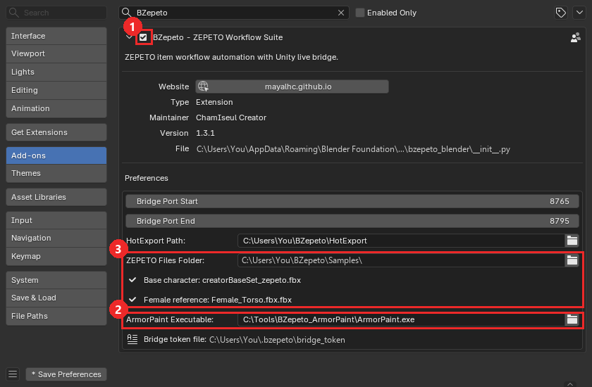
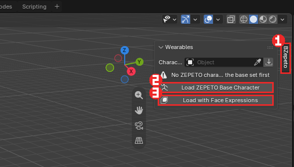
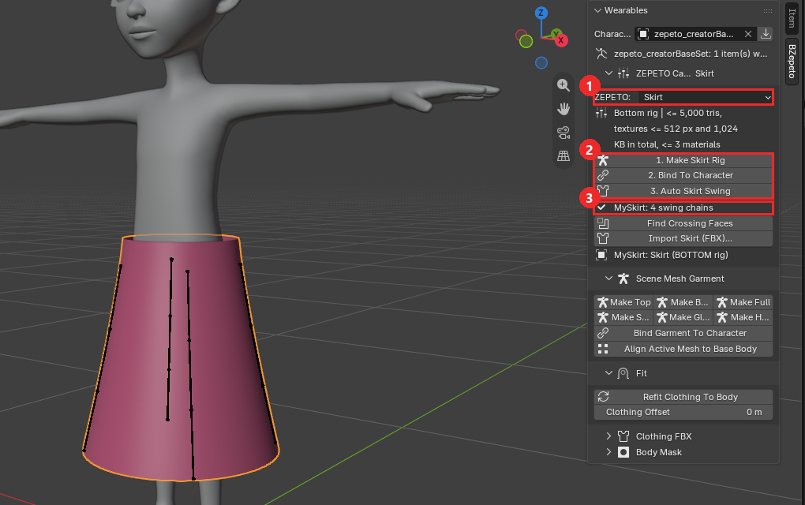
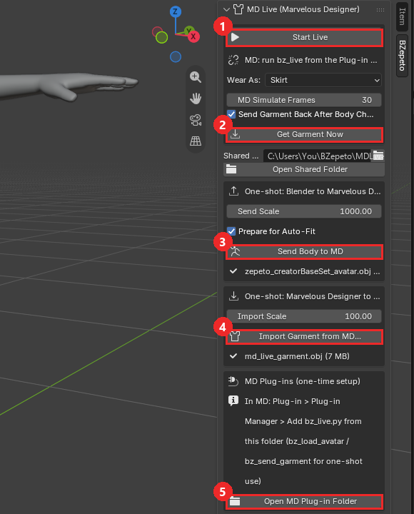
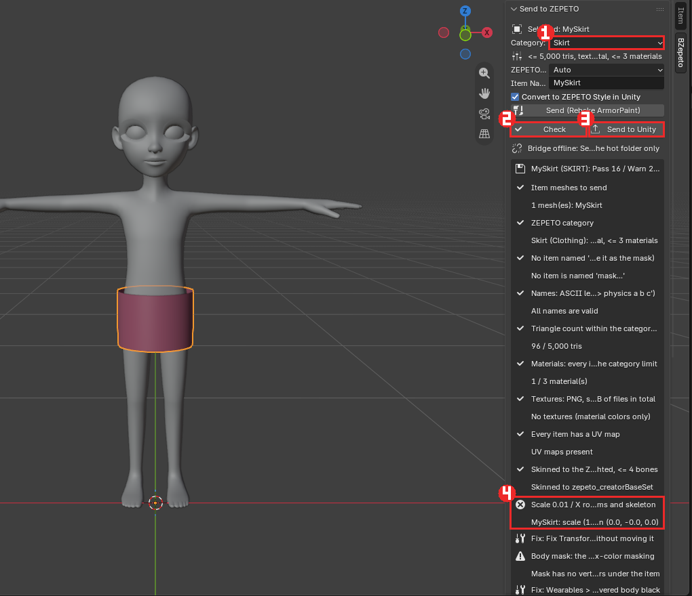
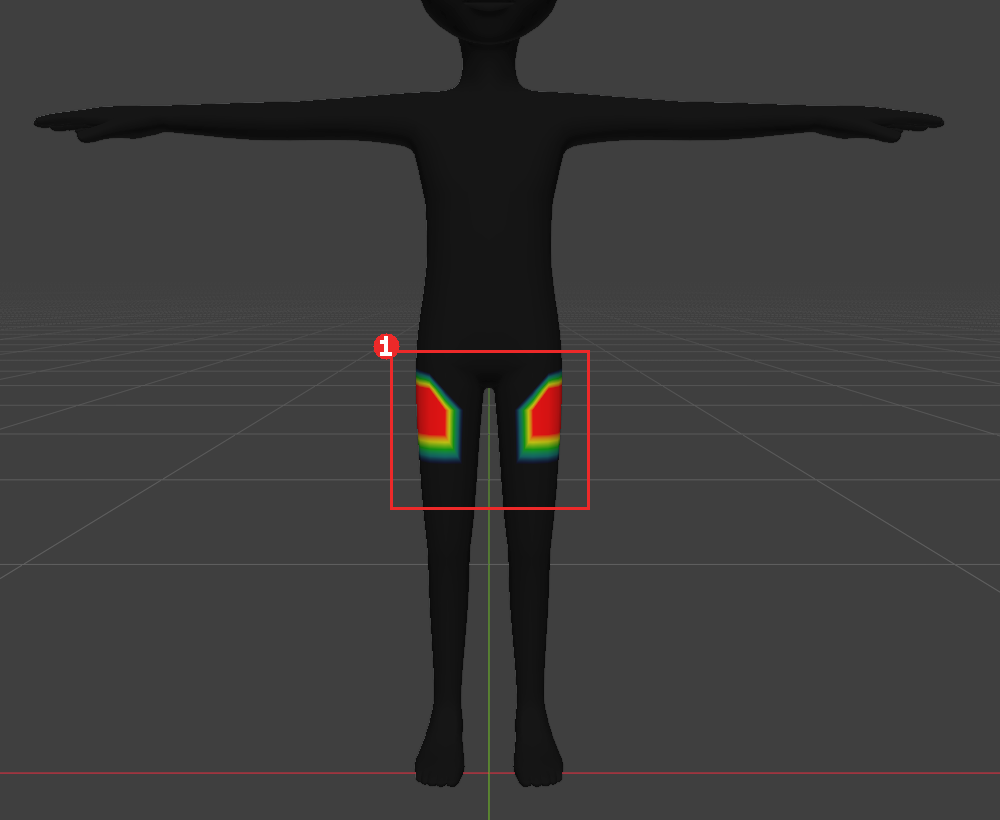
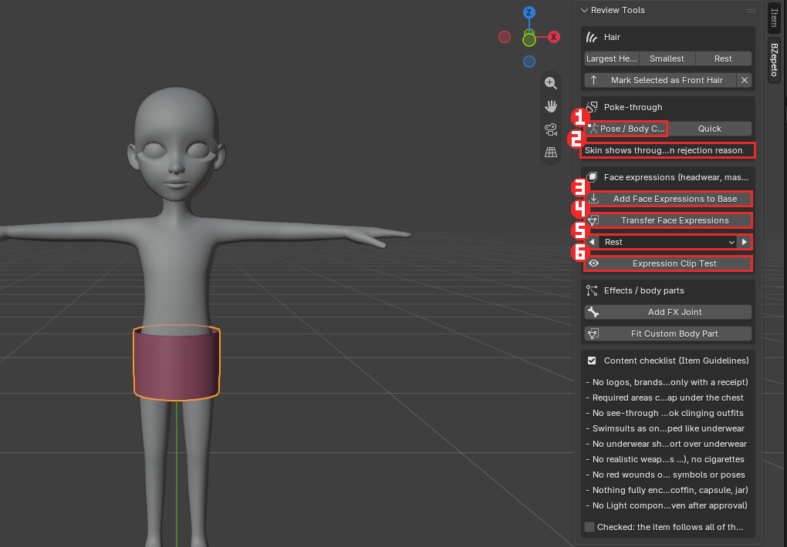
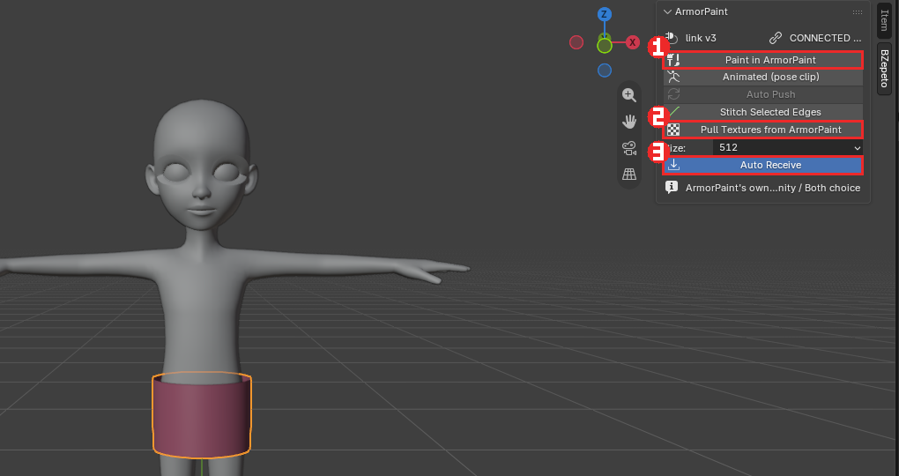
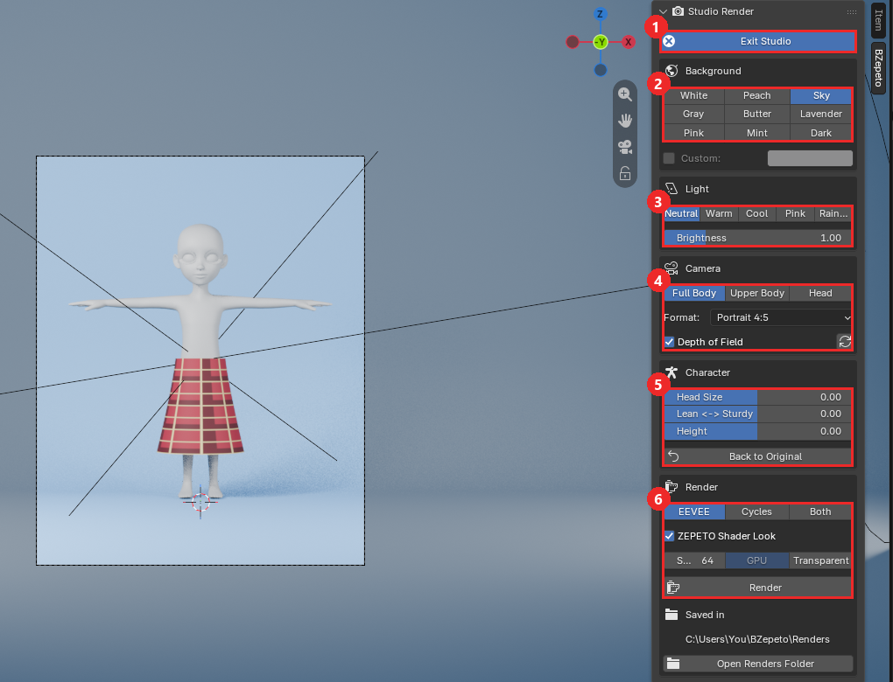
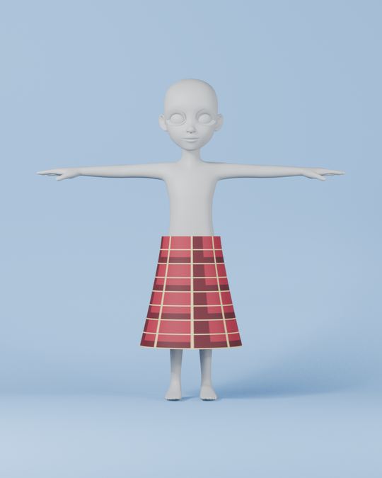

# Blender 애드온

[🇺🇸 English](./blender.md) | 🇰🇷 한국어

그림의 빨간 상자가 누를 곳이고, 번호 순서대로 누르면 됩니다.

## 1. 설치

1. Blender에서 **편집(Edit) > 환경 설정(Preferences) > Add-ons**, 오른쪽 위 **▼** 를 눌러
   **Install from Disk**
2. `bzepeto_blender-<버전>.zip` 을 고릅니다 — zip 그대로, **압축을 풀지 마세요**
3. 검색 칸에 `BZepeto` 를 입력하고 애드온이 체크되어 있는지 확인합니다 **①**
4. 작은 화살표로 펼쳐서 **ArmorPaint Executable** **②** 을 ArmorPaint를 푼 폴더의 `ArmorPaint.exe` 로
   지정합니다 ([ArmorPaint 설치](KO_armorpaint.md) 참고)

**ZEPETO Files Folder** **③** 는 애드온이 읽는 제페토 파일을 **한 폴더**에 모아 두는 곳입니다(기본
`%USERPROFILE%\BZepeto\Samples\`). 이 폴더에 제페토의 `creatorBaseSet_zepeto.fbx`(베이스 캐릭터)와
`Female_Torso.fbx`(Body Shape > Female 용 여성 레퍼런스)를 두세요 — 이름으로 찾으므로 `Female_Torso.fbx.fbx` 처럼
받아진 이름도 됩니다. 바로 아래에 두 파일을 찾았는지(✔ / 찾지 못함) 표시됩니다. BZepeto에는 들어 있지 않으니 제페토
크리에이터 자료에서 받으세요. 예전 버전에서 파일을 따로 지정해 두었다면 그 설정도 계속 쓰입니다.

## 2. BZepeto 탭과 베이스 캐릭터

1. 3D 뷰포트에서 **N** 키를 누르고, 오른쪽 끝의 **BZepeto** 탭 **①** 을 누릅니다
2. **Wearables** 에서 **Load ZEPETO Base Character** **②** 를 누릅니다
3. 헤드웨어·마스크를 만든다면 대신 **Load with Face Expressions** **③** — 베이스에 제페토 얼굴 표정
   249개도 함께 들어갑니다

**패널 접기** — BZepeto 패널의 부분(포즈, 하이힐, 웨이트, 체형, Send 항목 …)은 머리줄의 **▸/▾** 로
접을 수 있습니다. 접힌 머리줄에 핵심 상태(현재 포즈, 힐 각도, 스윙 체인 수, 웨이트 문제 수 …)가 그대로
표시되므로, 쓰지 않는 부분은 접어 두면 패널이 짧아집니다. Blender 가 열림·접힘 상태를 기억합니다.

## 3. 리깅 (Rigging)

- **본 개수** — 내 리그를 제페토 기본 뼈대(104개)와 비교하고, 추가한 스윙 본 수를 셉니다
- **포즈** — T 포즈와 A 포즈 전환. 되돌릴 때는 저장해 둔 리그를 복원하므로 여러 번 바꿔도 어깨가
  틀어지지 않습니다
- **웨이트** — 전송, 좌우 대칭, 영향 뼈 4개로 제한
- **Bone Cleaner** — 쓰지 않는 뼈 제거

### 하이힐 (High Heel)

포즈 아래 **High Heel** 상자에서 뒤꿈치를 올립니다. 발가락(toes)은 바닥에 평평하게 **제자리**에 있고,
몸이 그만큼 올라갑니다.

1. **Heel Angle** — 뒤꿈치를 드는 각도(도). **Sole (cm)** — 앞창(플랫폼) 두께
2. 올라간 발에 맞춰 신발을 모델링합니다
3. 신발을 선택하고 **Make Garment (Shoes)** → **Bind Garment To Character**. 신발은 모델링한 자리에
   그대로 있고, 내부적으로는 제페토가 쓰는 평발 기준으로 바인드됩니다
4. **Export / Send** — 신발(Shoes) 아이템에만 제페토 힐 정보(`expressions` 본)가 들어갑니다.
   제페토가 이 값으로 아바타의 발·발가락·골반을 움직여 블렌더에서 본 모양 그대로 신습니다.
   상의·원피스 같은 다른 아이템에는 들어가지 않습니다

- **Flat Feet** — 힐을 끕니다
- **Read Heel From Rig** — 제페토 하이힐 아이템을 불러왔을 때 그 힐 값을 슬라이더로 가져옵니다
- 힐은 포즈로만 보여 주며 rest 포즈에 굽지 않습니다. 체형 슬라이더·T/A 전환을 해도 유지됩니다

### 장갑·네일·반지 (Glove Test)

- **Make Garment** 에서 장갑 계열(장갑·네일·반지·팔찌)은 정점마다 **자기 손가락 피부에서만** 웨이트를 받습니다
  (손가락 사이 틈에서 옆 손가락 뼈가 섞이지 않음)
- **네일**은 조각마다 그 손가락 **끝마디 뼈 하나**에, **반지**는 조각마다 **뼈 하나**에 100% 로 붙습니다
- **Glove Test > Fist** — 슬라이더를 올리면 양손이 주먹을 쥡니다. 장갑·반지·네일이 손가락을 따라가는지 보는 용도이고,
  내보내기에는 영향이 없습니다(항상 편 손)

### 치마·원피스·코트

치마(Skirt)·원피스(Dress)·아우터(Outerwear)로 Make Garment 하면 다리 웨이트가 둘레를 따라 **서서히** 좌우로 나뉩니다
(앞뒤 가운데는 양다리 반반, 옆은 그쪽 다리만). 걸을 때 치마가 가운데에서 바지처럼 갈라지지 않습니다

### 스윙 본 (머리카락, 치마, 리본)

1. 에디트 모드에서 체인이 따라갈 **엣지 줄을 선택**합니다(치마의 세로 줄 4개 = 체인 4개)
2. 만들기 전에 패널이 결과를 알려 줍니다: *"4 chain(s), 12 bone(s)"*
3. 체인당 뼈 수, 프리셋(헤어, 리본, 치마, 코트, 액세서리), 매달 뼈, 웨이트 반경을 고릅니다
4. **Make Swing Chains**

뼈 이름은 제페토 SDK 가 읽는 형식 `<관절>_physics_<drag>_<angle drag>_<restore drag>` 로 자동으로
붙습니다(예: `hair_01_physics_10_15_20`). 제페토 권장은 아이템당 체인 2–5개. **Remove Physics Naming** 은 physics 부분을
다시 지웁니다.

!!! warning "1.3.1 이전에 만든 흔들림 뼈"
    예전 버전은 `hair_01 physics 10 15 20` 처럼 **띄어쓰기**로 이름을 붙였는데, 제페토는 이름에 `_physics` 가 있는 뼈만
    흔듭니다 — 그래서 Unity·제페토에서 흔들리지 않았습니다. **Fix Swing Names** 를 한 번 누르고 아이템을 다시 보내세요
    (값과 웨이트는 그대로). Send 검사가 이런 뼈를 찾아 알려 줍니다.

**Auto Skirt Swing** — 치마·원피스·롱코트에 흔들림 본을 한 번에 넣습니다. Wearables > ZEPETO Category 에서 Skirt·Dress·
Outerwear 를 고르면 그 칸에 **1. Make Rig → 2. Bind To Character → 3. Auto Skirt Swing** 버튼이 순서대로 있습니다.
치마 안에 속바지·안감이 한 메쉬로 붙어 있어도 체인은 바깥 치마에 놓이고, 속바지는 흔들리지 않고 다리를 따라갑니다.
엣지를 고를 필요 없이 체인(기본 4개, 2–5)을 고관절 높이에서 밑단까지, 천 바로 안쪽에 놓습니다.

**①** ZEPETO 카테고리(Skirt) **②** 순서대로 누르는 세 버튼 **③** 끝나면 `MySkirt: 4 swing chains` 처럼 체인 수가
표시됩니다. 뷰포트의 세로 막대 4개가 허벅지에 매달린 흔들림 체인입니다.

**Find Crossing Faces** — 큰 자세에서 옷 허리·겹친 부분이 들쭉날쭉하게 보이면, 옷 메쉬가 **처음부터 스스로를 뚫고**
있는 경우가 많습니다(마블러스 디자이너에서 내보낸 겹옷·플랩·허리띠 고리). 이 버튼은 지금 자세에서 다른 면을 뚫는
면을 에디트 모드로 선택해 줍니다. 웨이트로는 고칠 수 없으니 MD 에서 레이어 간격을 띄우거나 숨은 안쪽 면을 지우세요.

**Follow the Legs**(기본 켜짐) — 제페토 기본 흔들림에는 다리 충돌이 없어서, 골반에 매단 체인은 다리를 들어도 제자리에
있고 **허벅지가 치마를 뚫고 나옵니다**. 그래서 체인을 대각선(왼앞·오른앞·왼뒤·오른뒤)에 놓고 각각 **그쪽 허벅지에
매답니다**: 다리를 들면 치마가 다리와 함께 나가고, 흔들림은 그 위에 더해집니다. 발목 길이 치마 측정: 크게 걸을 때(45°)
뚫고 나온 다리 점 694 → 41, 보통 걸음(30°) 220 → 0. 체인 수는 짝수(2·4)가 좋습니다(홀수면 하나가 뒤 가운데 골반에).

위쪽은 원래 웨이트 그대로, 밑단으로 갈수록 흔들림이 늘어납니다(**Swing at the Hem**, 기본 0.7 — 허벅지에 매달면
가장 덜 뚫림; Follow the Legs 를 끄면 0.4 권장).
다시 누르면 이전 체인을 지우고 새로 만듭니다.

## 4. 체형 (Body Shape)

키, 어깨 너비, 가슴, 허리, 골반, 다리 길이, 목, 머리 크기 슬라이더 8개. **Realtime** 을 켜면 드래그하는
동안 캐릭터가 바로 바뀝니다. 다리 길이는 제페토 SDK와 같은 방식으로 뼈를 움직여 발이 바닥에 붙어 있습니다.

## 5. 의상 (Wearables)

`Import Clothing (FBX)` (Top / Bottom / Full / Head Accessory 버튼) → `Align Mesh to Base Body` →
`Make Garment Rig` → `Bind Garment To Character` → `Refit Clothing To Body`.
**Auto Mask from Items** 는 아이템이 덮는 몸을 검게 칠합니다(제페토가 그 부분을 숨깁니다).

**헤드웨어·헤어 피봇** — 제페토의 헤드 템플릿(`HEADWEAR_Guide`)은 **머리 관절(head)이 원점**에 있습니다(앱이 헤어·모자·
안경을 캐릭터 머리에 붙이기 때문). BZepeto 캐릭터의 머리는 약 0.89m 위에 있어서, 가이드로 만든 아이템은 그대로면 발밑에
놓입니다. `Head Accessory` 가져오기와 `Make Head Acc` / `Make Hair Rig` 가 이 배치를 알아보고 머리 위로 올립니다
(웨이트가 없는 조각은 head 뼈에). 보낸 아이템은 제페토에서 가이드로 만든 것과 같은 자리에 붙습니다(Unity 변환 결과로 확인).

**마스크를 면 단위로 다듬기** — 제페토는 흰색이 아닌 **정점**을 숨기고, 그 정점에 닿은 삼각형을 통째로
지웁니다. 그래서 색을 더 세밀하게 칠해도(섭디바이드 등) 결과는 달라지지 않습니다. 대신 결과 자체를 보고
면 단위로 고치세요:

- **Show Removed Triangles** — 제페토에서 실제로 지워질 삼각형을 몸 위에 빨갛게 표시합니다(포즈·체형을
  바꿔도 따라감). Auto Mask 를 누르면 자동으로 켜집니다.
- 몸(`mask`)을 선택하고 Tab 으로 에디트 모드 → 면 선택 → **Mask Faces** 는 그 면을 지우고,
  **Unmask Faces** 는 되살립니다. Mask Faces 는 기본적으로 **선택 밖의 면은 절대 지우지 않습니다**
  (그래서 선택 가장자리의 면이 남을 수 있음). 선택한 면을 전부 지우려면 실행 후 왼쪽 아래 창에서
  **Cover Whole Selection** 을 켜세요(바깥 한 줄도 같이 지워짐).
- **Select Removed Faces** — 지금 지워지는 면을 선택해 줍니다. Auto Mask 결과에서 바로 손볼 때 편합니다.

### 마블러스 디자이너 (Marvelous Designer)

제페토 캐릭터를 마블러스 디자이너로 보내 옷을 만들고, 완성된 옷을 **입힌 상태로** 가져옵니다.
BZepeto 탭의 **MD Live (Marvelous Designer)** 패널에 있습니다.

**①** Start Live **②** Get Garment Now **③** Send Body to MD **④** Import Garment from MD **⑤** Open MD Plug-in Folder

**처음 한 번만**

1. **Open MD Plug-in Folder** 를 눌러 플러그인 폴더를 엽니다.
2. 마블러스 디자이너에서 **Plug-in ▸ Plug-in Manager ▸ Add** 로 `bz_live.py` 를 등록합니다.
   한 번씩 주고받는 `bz_load_avatar`(아바타 불러오기), `bz_send_garment`(옷 보내기)도 원하면 같이 등록하세요.

**라이브 (자동)**

1. Blender 에서 **Start Live**.
2. 마블러스 디자이너에서 Plug-in 메뉴의 `bz_live` 를 한 번 누릅니다(다시 누르면 멈춤).
   패널에 `MD: bz_live running` 이 보이면 연결된 것입니다.

그다음부터는 누를 것이 없습니다:

- Blender 에서 **포즈·체형·하이힐** 을 바꾸면 몸이 자동으로 다시 보내지고, 마블러스 디자이너가 아바타를
  바꾼 뒤 **MD Simulate Frames**(기본 30)만큼 시뮬레이션해서 옷을 돌려보냅니다.
- 돌아온 옷은 **Wear As** 카테고리로 리깅되어 입혀지고, 이전에 라이브로 받은 옷을 대신합니다.
- 마블러스 디자이너에서 옷을 고친 뒤에는 **Get Garment Now** — 지금 옷을 바로 받습니다.
- 옷은 오브젝트 모드에서 받습니다. 다른 모드에 있으면 "Garment waiting" 이 뜨고, 돌아오면 입혀집니다.

**한 번씩 주고받기 — 캐릭터 보내기**

1. Blender 에서 **Send Body to MD** — 지금 포즈·체형 그대로의 제페토 몸이 공유 폴더에 OBJ 로 저장됩니다.
2. 마블러스 디자이너에서 Plug-in 메뉴의 `bz_load_avatar` — 가져오기 창 없이 아바타로 들어옵니다. 다시 보내면
   아바타가 교체되고 두 개가 되지 않습니다.

**한 번씩 주고받기 — 옷 가져오기**

1. 마블러스 디자이너에서 `bz_send_garment` — 옷만(아바타 제외) 공유 폴더에 저장됩니다.
2. Blender 에서 **Import Garment from MD** — 가장 최근 옷이 미리 골라져 있습니다. **ZEPETO Category** 를
   고르면 그 카테고리 방식으로 리깅되어 바로 입혀집니다(Make Garment Rig + Bind 와 같음).

**알아두면 좋은 점**

- 공유 폴더는 비워 두면 `%USERPROFILE%\BZepeto\MDLive` 입니다. 폴더와 배율은 기억됩니다.
- 단위: BZepeto 플러그인으로 보낸 옷은 단위가 함께 기록되어 그대로 맞습니다. MD 메뉴에서 직접 내보낸 옷은
  **Import Scale** 을 쓰고, 그래도 몸에 맞지 않으면 mm·cm·inch·m 중 맞는 단위를 자동으로 찾습니다.
- 탑스티치는 내보내는 동안만 텍스처로 바뀌어(끝나면 원래대로) 파일이 가볍습니다. 직접 내보낸 큰 파일도
  스티치·단추·지퍼는 읽기 전에 빠집니다(**Skip Stitches & Trims**) — 300 MB 셔츠가 1~2 초에 들어옵니다.
- 제페토 삼각형 한도를 넘기 쉬우니 마블러스에서 **Particle Distance** 를 키워 메쉬를 성기게 하세요.

## 6. Send to ZEPETO

1. 아이템을 선택하고 **Category** **①** 를 고릅니다(예: Skirt) — 아래에 그 카테고리 한도가 나옵니다
2. **Check** **②** 를 누르면 결과 목록이 나옵니다: ✔ 통과, ⚠ 경고, ✖ 고쳐야 함 — 기본은 **문제 항목만**
   보이고, 아래 **Show all** 을 누르면 통과한 항목 전체가 보입니다
3. 실패한 항목 아래에는 고치는 버튼이 함께 나옵니다 **④** (예: **Fix Transforms**,
   **Create ZEPETO Material**, **Shrink Textures to 1 MB**)
4. 빨간 항목이 없으면 **Send to Unity** **③**

검사 항목은 20가지입니다: 삼각형 수, 머티리얼, 머티리얼 이름, 텍스처 크기(512px)와 **텍스처 파일 총 1MB**,
UV, 본 영향 수, 트랜스폼, 이름, 마스크, 헤어, 아이템 크기, 얼굴 표정 등.

**머티리얼 이름 (제페토 규칙)** — 제페토 가이드는 머티리얼을 *아이템 이름 + `_shd`* 로 짓습니다
(예: `TOP_turtleneck_shd`). 메쉬 이름은 종류 접두어로 시작합니다: 원피스 `DR`, 상의 `TOP`, 하의·치마 `BTM`,
헤드웨어 `HEADWEAR`. 커스텀 몸통은 `skin` 그대로 둡니다.

- `Material.001`, `lambert2` 같은 기본 이름이거나 `_shd` 로 끝나지 않으면 경고가 나오고, 바꿀 이름을
  보여 줍니다(예: `Material -> TOP_shirt_1_shd`)
- **Fix Material Names** 를 누르면 머티리얼 이름이 한 번에 바뀝니다. 기본 이름은 메쉬 이름을 따르고,
  여러 개면 번호가 붙습니다. 메쉬 이름은 직접 바꿔 주세요
- BZepeto가 자동으로 만드는 머티리얼도 `<메쉬 이름>_shd` 입니다

**ZEPETO Shader** — Send 패널에서 아이템의 셰이더를 고릅니다(Auto는 Unity가 이름으로 추측).
셰이더는 아이템과 함께 Unity로 가고, ArmorPaint의 ZEPETO Mode도 이에 맞춰집니다.

| 셰이더 | 용도 |
|---|---|
| Lit | 일반 아이템 |
| Cloth | 벨벳 같은 광택 |
| Fur | 털 |
| HairAlpha | 가닥이 비치는 헤어 |
| Sparkle | 반짝이 |
| Iridescence | 진주, 홀로그램 |
| Prism | 클리어코트, 에나멜 |
| CustomEnv | 보석, 고광택 — 자기 HDRI를 반사 |
| Toon | 툰 셰이딩 |
| Detail Normal | 반복되는 미세 디테일 |

**헤어 (HairAlpha)** — 가닥이 UV V 방향이 아닐 때, 베이스 컬러에 알파가 없을 때, 카드 층 순서가
뒤섞였을 때 알려 줍니다. **Sort Hair Layers** 는 안쪽 카드를 먼저 그리도록 정렬합니다.

**CustomEnv** — **Env HDRI**(`.hdr`, 256×128이나 512×256 정도의 작은 2:1 파노라마, 1MB에 포함)를
지정하면 Unity에서 반사 큐브맵이 됩니다.

**텍스처 1MB** — 합계가 넘으면 힌트에 "base 1024 -> 512 px (약 700 KB)"처럼 줄일 맵이 나오고,
**Shrink Textures to 1 MB** 가 줄인 사본을 원본 옆에 만들어 재질에 연결합니다. 원본은 그대로 둡니다.

## 7. Review Tools (Send 아래)

1. **Pose / Body Clip Test** **①** — 아이템을 입힌 캐릭터에 제페토 미리보기 포즈 10종(다리 들기·발차기
   포함)을 체형 DEFAULT·ANIME, 데포메이션 DEFAULT·1–4 에서 차례로 적용합니다. **Quick** 은 기본 체형과
   큰 데포메이션(3·4)만 봅니다
2. 결과 **②** 에 가장 심한 포즈가 나옵니다. 큰 체형에서 구멍이 나는 아이템은 실제로 반려된 사례가 있습니다
3. 어디인지 보려면: 몸(`mask`)을 선택하고 **Weight Paint** 모드에서 `BZ_Clip` 그룹을 고르면 뚫린 살이
   빨갛게 보입니다 **①**

**얼굴 표정 (헤드웨어, 액세서리 마스크, 스페셜 마스크)**

- **Add Face Expressions to Base** **③** — 불러온 베이스에 표정 249개를 공식 이름·순서로 만듭니다.
  내가 받은 제페토 베이스에 표정의 변화량만 입히며, 다른 베이스면 건너뛰고 알려 줍니다
- **Transfer Face Expressions** **④** — 얼굴 아이템을 먼저 선택합니다. 각 부분이 바로 아래 얼굴을 따라
  움직입니다(얼굴에서 1cm 안은 그대로, 4cm까지 서서히 약해짐). 아이템을 움직이지 않는 표정은 빠집니다
- **◀ Rest ▶** **⑤** — 표정을 하나씩 얼굴과 아이템에 보여 줍니다
- **Expression Clip Test** **⑥** — 제페토 베이스 얼굴에 모든 표정과 가이드가 말하는 조합(jawOpen+mouthClose,
  jawOpen+cheekPuff, 눈썹+깜빡임)을 적용해 두 가지를 봅니다: 얼굴이 아이템을 **뚫는지**, 그리고 아이템이 얼굴을
  **따라가는지**. 얼굴이 움직였는데 아이템이 제자리에 남는 표정이 나오면 "stay behind" 로 알려 주고, 그 부분은
  아이템의 `BZ_Follow` 그룹(Weight Paint에서 빨강)에 표시됩니다 — Transfer Face Expressions를 다시 하면 됩니다
- **Play Expressions** — 모든 표정을 베이스 얼굴과 얼굴 아이템에 **타임라인 애니메이션**으로 만듭니다(표정마다 10프레임,
  마커에 표정 이름). **Play**(Space)를 누르면 아이템이 얼굴을 따라가는지 눈으로 볼 수 있습니다. Expression Clip Test도
  검사 뒤 같은 애니메이션을 만들고, 문제가 있던 표정은 마커에 `! jawOpen: 124 through, 119 behind` 처럼 표시하고 첫
  문제 표정으로 이동합니다. 옆의 **X** 는 키와 마커를 지우고 프레임 범위를 되돌립니다

**인형탈 표정 (Mascot Head Expressions)** — 얼굴보다 크고 떨어져 있는 탈(스페셜 마스크, 인형탈 머리)

위의 Transfer Face Expressions 는 얼굴에 붙은 아이템(4cm 안)용이라 큰 탈에는 닿지 않습니다. 탈의 눈·입은 실제
얼굴의 눈·입과 위치도 크기도 다르기 때문입니다.

1. 탈을 선택하고 Tab(에디트 모드) → 탈의 **눈** 정점을 선택 → **Mark Eyes**. 양쪽 눈을 한 번에 선택해도 됩니다
   (좌우는 자동으로 나눔). 같은 방법으로 **Mark Brows**(눈썹), **Mark Mouth**(입). 잘못 넣었으면 **Unmark …**
2. **Transfer to Mascot Head** — 탈의 각 부위를 얼굴의 같은 부위에 크기 비율대로 맞추고, 얼굴이 움직이는 만큼
   **크기에 맞게 키워서** 표정을 굽습니다. 예: 얼굴 눈의 1.3배 크기인 탈 눈은 1.3배만큼 깜빡임
3. 표시한 부위 가장자리는 자연스럽게 이어지고, 나머지 머리는 움직이지 않습니다. ◀ Rest ▶ 나 Play Expressions 로 확인
4. 얼굴형 슬라이더(얼굴 길이·눈 크기 등)는 기본으로 빼서 탈이 유저 얼굴 설정과 상관없이 모양을 유지합니다
   (옵션 **Face Shape Sliders Too** 로 포함 가능)

표시는 뼈 웨이트가 아니라 메쉬 속성이라 Send 검사·FBX 에는 들어가지 않습니다. 눈을 감기게 하려면 탈에 눈꺼풀이
될 면(눈 위쪽 살)이 있어야 합니다.

같은 패널에 헤어 **Head Size Test**(앱이 쓰는 가장 작은·큰 머리), **Mark Selected as Front Hair**,
이펙트용 **Add FX Joint**, **Fit Custom Body Part**, 콘텐츠 체크리스트(제페토 콘텐츠 규정을 확인했으면
체크)가 있습니다.

## 8. ArmorPaint에서 칠하기

1. 아이템을 선택하고 **Paint in ArmorPaint** **①** — 아이템이 열린 채로 ArmorPaint가 뜹니다
2. **Auto Receive** **③** 가 켜져 있으면 칠한 텍스처가 알아서 돌아옵니다. **Pull Textures from ArmorPaint**
   **②** 는 직접 가져오기입니다
3. **Stitch Selected Edges** 는 선택한 시접 엣지(에디트 모드)에 스티치를 ArmorPaint 레이어로 그립니다.
   **Animated (pose clip)** 는 뼈대와 액션을 함께 보내 늘어나는 포즈에서 칠할 수 있게 합니다

ArmorPaint 쪽 사용법: [ArmorPaint](KO_armorpaint.md).

### 세트 의상 — 상의·하의에 맵을 따로 (UDIM)

원피스·세트 의상처럼 상의와 하의가 한 아이템일 때, 재질마다 자기 텍스처를 입힐 수 있습니다
(제페토 Dress 카테고리는 텍스처 2장까지 허용, 합계 1MB).

1. 재질을 두 개 만듭니다 — 예: `DR_227_TOP`, `DR_227_BTM`
2. UV 편집기에서 상의 UV는 **0–1 칸(1001)**, 하의 UV는 **오른쪽 칸(1002, U 1–2)** 에 둡니다.
   UV를 옮기지 않고 재질만 두 개여도 됩니다 — 재질 순서대로 1001, 1002가 됩니다
3. **Paint in ArmorPaint** — ArmorPaint에 타일별로 `아이템.1001`, `아이템.1002` 가 열리고, 각 타일에
   따로 칠합니다
4. 받은 맵(`아이템_base.1001.png`, `아이템_base.1002.png` …)은 **자기 재질에만** 연결됩니다
5. **Send to Unity** — FBX 안에서만 UV를 0–1로 옮기고(Blender 씬은 그대로), Unity가 재질마다 자기 맵을
   연결합니다

Blender의 머티리얼은 **이름과 색 그대로** ArmorPaint에 만들어지고, 각 타일에 자기 머티리얼이 채워진 채로
열립니다(Layers에 머티리얼마다 레이어 하나). FBX를 가져와서 검게 남아 있는 머티리얼은 칠하기 쉽게 중립 회색으로
옵니다.

Send의 UV 검사에 *"one texture set per material (DR_227_TOP 1001, DR_227_BTM 1002)"* 가 나오면
제대로 나뉜 것입니다. 한 재질이 두 칸에 걸쳐 있으면 경고가 나옵니다.

## 9. ZEPETO Playground

ZEPETO Studio의 플레이 모드 메뉴를 Blender에서 그대로 재현합니다: 애니메이션 10종, 카메라, 체형 타입,
SDK 데포메이션 13종, 스페이스 — Unity로 넘기기 전에 아이템을 확인할 수 있습니다.

> 플레이그라운드는 내 ZEPETO Studio 프로젝트에서 캡처를 한 번 해야 쓸 수 있습니다: Unity에서
> 플레이그라운드 씬을 Play 모드로 실행하고 **BZepeto > Capture Playground For Blender**를 누르세요.

## 10. 스튜디오 렌더 (Studio Render)

캐릭터 빌더 홍보 이미지처럼, 아이템을 입은 캐릭터를 스튜디오에서 찍습니다. BZepeto 탭의 **Studio Render** 패널.

번호는 아래 순서와 같습니다: **①** Start/Exit Studio **②** Background **③** Light **④** Camera **⑤** Character **⑥** Render

1. **Start Studio** — 이음매 없는 배경(바닥이 벽으로 둥글게 이어짐), 부드러운 3점 조명(키·필·림), 85 mm 인물 카메라가
   캐릭터에 맞춰 생기고 뷰포트가 카메라 시점의 **렌더 화면**으로 바뀝니다(아래 Render 에서 고른 EEVEE/Cycles 로). 캐릭터의 지금 포즈(A/T 포즈, 하이힐, 플레이그라운드
   애니메이션 프레임)를 그대로 찍습니다.
2. **Background** — 흰색·회색·핑크·피치·버터·민트·스카이·라벤더·다크, 또는 **Custom** 색.
3. **Light** — Neutral·Warm·Cool·Pink·**Rainbow**(세 조명이 세 가지 색), **Brightness**.
4. **Camera** — **Full Body / Upper Body / Head** 구도, **Format**(1:1, 4:5, 9:16, 16:9), **Depth of Field**(배경 흐림).
   포즈·체형·아이템을 바꾼 뒤에는 **Frame Again**.
5. **Character** — 빌더처럼 **Head Size**, **Lean ↔ Sturdy**(가슴·허리·골반·어깨 함께), **Height**.
   **Back to Original** 은 체형 슬라이더를 모두 0 으로.
6. **Render** — **EEVEE**(빠름), **Cycles**(노이즈 제거, **GPU** 로 — 환경설정 > System 의 장치, 없으면 자동 선택), **Both**(둘 다 한 장씩). **Transparent** 를 켜면 배경이 투명한
   PNG(Cycles 는 바닥 그림자를 남김). 그림은 `%USERPROFILE%\BZepeto\Renders` 에 저장됩니다(**Open Renders Folder**).

**ZEPETO Shader Look** — Send 에서 아이템에 제페토 셰이더를 골라 두었으면 렌더에서 그 느낌을 냅니다: Cloth·Fur 는
천 색의 광택, HairAlpha 결 하이라이트, Sparkle 반짝이, Iridescence 무지개 막, Prism 코팅, CustomEnv 강한 광택,
Toon 평평한 색. 렌더하는 동안만 쓰는 사본이라 **아이템 재질은 바뀌지 않습니다**. 실제 모습은 Unity·제페토 미리보기가 기준입니다.

**Exit Studio** 를 누르면 스튜디오가 더한 것이 모두 지워지고 렌더 엔진·해상도·카메라·월드가 원래대로 돌아갑니다.
Send·Export 에는 스튜디오 물체가 들어가지 않습니다.

!!! note "얼굴·머리카락"
    제페토 베이스 캐릭터는 텍스처 없는 회색 몸이라, 눈·입술·머리카락은 직접 만든 얼굴 텍스처와 헤어 아이템이
    있어야 보입니다.
