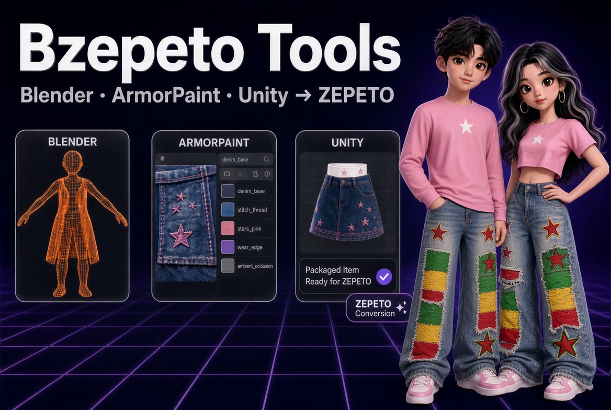

# BZepeto — ZEPETO Item Creator Suite for Blender, Unity & ArmorPaint

[🇺🇸 English](./index.md) | 🇰🇷 한국어

> BZepeto는 Chamiseul(ChamIseul Creator)이 만든 독립 도구입니다. NAVER Z(ZEPETO), Blender 재단,
> Unity Technologies, ArmorPaint 개발자가 만들거나 보증·지원하는 제품이 아닙니다.



제페토 아이템을 만드는 전 과정을 한곳에서: Blender에서 만들고, ArmorPaint에서 칠하고, Unity의
ZEPETO Studio로 넘깁니다. 단계마다 내보내기·가져오기·재질 연결을 손으로 할 필요가 없습니다.

```
Blender  ──①──>  ArmorPaint  ──②──>  Blender
   │                  └────③────>  Unity (ZEPETO Studio)
   └──────────────④──────────────>  Unity (ZEPETO Studio)
```

① 메쉬가 실시간으로 ArmorPaint로 ② 칠한 텍스처가 돌아옴 ③ 텍스처가 바로 Unity로 ④ 완성된
아이템이 검사·패키징되어 Unity로

**왼쪽 메뉴에서 도구를 고르세요:**

| 페이지 | 내용 |
|---|---|
| [Blender 애드온](KO_blender.md) | 설치, 베이스 캐릭터 불러오기, 검사와 Send, Review Tools, 얼굴 표정 |
| [Unity 패키지](KO_unity.md) | 설치, 자동 가져오기와 제페토 셰이더, 검사 메뉴 |
| [ArmorPaint](KO_armorpaint.md) | 설치, 라이브 링크, **처음 쓰는 분을 위한 노드 샘플**, 재질 라이브러리, ZEPETO Mode, 스티치 |
| [도움말·FAQ](KO_help.md) | 문제 해결, 자주 묻는 질문, 반려 사례, 라이선스 |

---

## 필요한 것

| | |
|---|---|
| OS | Windows 10 / 11, 64비트 |
| Blender | 4.5 이상 (4.5 – 5.3 확인) |
| Unity | ZEPETO Studio 프로젝트, **Unity 2020.3.9f1** |
| GPU | DirectX 12 지원 (ArmorPaint) |
| 제페토 베이스 캐릭터 | 제페토 크리에이터 자료의 `creatorBaseSet_zepeto.fbx` — 제페토의 파일이라 **포함되어 있지 않습니다** |

## 받은 파일

검로드에서 받는 파일은 `BZepeto_<버전>.zip` 하나입니다. **이 파일만** 압축을 푸세요(오른쪽 클릭 >
**압축 풀기**). 풀면 생기는 `BZepeto_<버전>` 폴더에 다음 파일이 있습니다:

| 파일 | 내용 | 설치 |
|---|---|---|
| `bzepeto_blender-<버전>.zip` | Blender 애드온 | [Blender 페이지](KO_blender.md) 1번 |
| `com.bzepeto.unity2020-<버전>.tgz` | **ZEPETO Studio(Unity 2020.3.9)** 용 Unity 패키지 | [Unity 페이지](KO_unity.md) 1번 |
| `BZepeto_ArmorPaint_<버전>_win64.zip` | BZepeto 플러그인이 켜진 ArmorPaint + 노드 샘플(`Template`) | [ArmorPaint 페이지](KO_armorpaint.md) 1번 |
| `SHA256SUMS.txt` | 파일 확인용 체크섬 | — |

!!! note "Blender 애드온은 압축을 풀지 마세요"
    Blender는 `bzepeto_blender-<버전>.zip` 을 zip 그대로 설치합니다. 압축을 푸는 것은 바깥
    `BZepeto_<버전>.zip` 과 ArmorPaint zip 뿐입니다.

사용 설명은 이 가이드 하나뿐입니다 — 받은 파일에는 README가 없습니다.

**업데이트라면** 새 버전이 나오면 검로드가 메일로 알려 줍니다. **검로드 라이브러리(Library)** 에서 새
`BZepeto_<버전>.zip` 을 받아 세 파일을 모두 설치하세요. Blender 애드온과 Unity 패키지는 이전 버전을
교체하고, ArmorPaint는 새 폴더에 풉니다.

## BZepeto가 파일을 두는 곳

모두 `%USERPROFILE%\BZepeto` 아래에 있습니다. 베이스 캐릭터는
`%USERPROFILE%\BZepeto\Samples\creatorBaseSet_zepeto.fbx` 에 두세요(또는 애드온 설정의 **ZEPETO Files Folder** 를 그 파일이 있는 폴더로).
Blender와 Unity는 둘 다 `%USERPROFILE%\BZepeto\HotExport` 를 주고받는 폴더로 쓰므로 따로 설정할 것이
없습니다. 다른 곳으로 옮기려면 환경 변수 `BZEPETO_HOME` (예: `D:\BZepeto`)을 지정하고 Blender와
Unity를 다시 시작하세요.

---

## 새 소식

### v1.3.1 — 스튜디오 렌더, 마블러스 디자이너 연동, 롱치마 흔들림 & 검사 정확도

!!! note "Blender 애드온과 Unity 패키지를 업데이트하세요"
    ArmorPaint 는 1.3.0 그대로 써도 됩니다(버전 표시만 바뀜).

**스튜디오 렌더** — 새 **Studio Render** 패널. 이음매 없는 배경·부드러운 조명·인물 카메라로 아이템을 입은 캐릭터를
찍습니다. 배경색·조명색(무지개 포함) 프리셋, 전신·상반신·얼굴 구도, 빌더식 슬라이더, EEVEE·Cycles, 투명 PNG,
제페토 셰이더 느낌까지 ([Blender 가이드](KO_blender.md#10-스튜디오-렌더-studio-render)).

**마블러스 디자이너 연동** — **MD Live** 패널. 제페토 캐릭터를 마블러스 디자이너로
보내고, 만든 옷을 받아 카테고리에 맞게 리깅·착용까지 합니다. **Live** 를 켜면 포즈·체형을 바꿀 때마다
마블러스 디자이너의 아바타가 바뀌고 옷이 다시 맞춰져 돌아옵니다 — 누를 것 없이
([Blender 가이드](KO_blender.md#마블러스-디자이너-marvelous-designer)).

**롱치마 자동 흔들림** — Rigging > Swing Bones > **Auto Skirt Swing**. 치마·원피스·롱코트에 흔들림 본을
한 번에 넣습니다(앞부터 4개, 고관절 → 밑단). 밑단 흔들림 기본 0.4 는 걸을 때 다리가 치마 밖으로 나오지
않는 값입니다

**검사가 더 정확해졌습니다** — 오류가 아닌데 오류·경고로 뜨던 것을 고쳤습니다:
- 헤드웨어 재질의 `(NoColor)` 가 이름 오류로 뜨고 **Fix Material Names 가 지우던 것**
- 리핏한 옷의 내부 쉐이프키가 **FBX 에 블렌드쉐이프로 실려 가던 것**(실제 버그)
- `_shd` 재질 이름·DR/TOP 메쉬 이름은 권장이라 경고 대신 제안으로
- 하이힐·플랫폼 신발의 "너무 큼", 액세서리의 "마스크 비어 있음", 헤어밴드·헤어핀의 "헤어 색"
- Export 검사: 재질 2개 원피스의 "하나로 합쳐라", 사용 안 하는 뼈, 텍스처 절대 경로
- Unity: 변환된 모든 프리팹의 Sprites-Default 경고, 스킨 없는 아이템의 "hips 없음" 오류,
  표정 없는 모자의 블렌드쉐이프 오류, 같은 아이템을 다시 보낼 때의 "texture matched no slot" 경고,
  모든 아이템의 "Can't import tangents" 경고(이제 FBX 에 탄젠트가 함께 나갑니다)

### v1.3.0 — 아머페인트 재질 라이브러리 & 하이힐

!!! warning "세 도구를 함께 업데이트하세요"
    v1.3.0 Blender 애드온, Unity 패키지, ArmorPaint를 **모두** 설치하세요. ArmorPaint는 **새 폴더**에
    풀고 **ArmorPaint Executable**을 새 위치로 바꿔 주세요.

**아머페인트 재질 라이브러리 (BZepeto Library 패널)** — 이번 업데이트의 주인공:

- **스마트 재질 32종** — Wool·Canvas·Linen·Suede·Corduroy·Tweed·Velvet·Satin·Sequin·Camo,
  Gold·Chrome·Copper·Rusty Iron·Painted Metal·Brushed Aluminium·Carbon Fiber·Gem,
  Glitter·Wood·Marble·Plastic·Rubber. 색·거칠기·금속·올록볼록까지 한 번에 들어가고, 절차적이라
  512px에서도 또렷합니다. 이후 10종 추가(Denim Wash·Rose Gold·Patina Copper·Neoprene·Cork·
  Terrazzo·Chalk Paint·Crushed Velvet·Tulle Net·Gold Sequin)
- **제너레이터 6종 + 메시 기반 2종** — Dirt(더러움)·Bleach Fade(바랜 티)·Mud(진흙)·Rust(녹)·Chipping(도장 벗겨짐)·
  Sparkle Dust(반짝이 먼지). 패턴이 곧 불투명도인 레이어를 한 클릭에 만들고, 검은 마스크를 칠해
  위치를 정합니다 (섭스텐스의 스마트 마스크 역할)
- **퀵 셋업 9종** — 상의·후디·청바지·치마·코트·신발·보석·헤어·툰. ZEPETO 모드 선택과 어울리는 재질
  적용이 버튼 하나로
- **재질 이름 자동 매칭** — Blender에서 보낸 재질 이름으로 재질을 다시 구성합니다
  (`gold_trim`→골드, `denim`→데님, `leather`→레더 …). 헤어·퍼·눈·입·레이스는 건드리지 않습니다

**하이힐** — **Heel Angle**·**Sole (cm)** 슬라이더로 뒤꿈치를 들고 신발을 모델링하면, 신발 FBX에
제페토의 힐 데이터(`expressions` 본)가 실려 미리보기에서도 모델링한 그대로 신겨집니다.
**Read Heel From Rig** 으로 기존 힐 아이템의 값도 슬라이더로 가져옵니다

**장갑·네일·반지** — 손가락을 구부릴 때 옆 손가락으로 새던 웨이트를 고쳤습니다. **Glove Test > Fist**
로 주먹을 쥐어 확인하세요

**인형탈 표정** — 얼굴보다 큰 탈도 표정을 받습니다: Mark Eyes / Brows / Mouth → **Transfer to Mascot
Head**. 탈 눈이 얼굴 눈의 1.3배면 1.3배로 깜빡입니다

**치마·원피스** — 걸음 포즈에서 앞가운데가 바지처럼 갈라지던 것을 고쳤습니다

**라이브 프리뷰 제거** — Unity 에디트 씬에는 캐릭터가 없어(SDK가 Play 때 생성) 동작할 수 없는 기능이었습니다. 체형·포즈 확인은 Blender의 **Playground**(제페토 미리보기 메뉴 + 뚫림 검사)가 담당합니다

**아머페인트 필터·노드 6종 추가** — 조정 레이어 6종(Blur·Sharpen·Invert·HSL·Levels·Warm Tint)과
  패션 무늬 GPU 노드(Tartan Plaid·Gingham·Polka Dots·Grunge·Water Drops·Glow Bands)

**기타** — 모든 패널이 섹션별로 접힙니다(▸/▾, 접힌 머리줄에 상태 표시). 검사 결과는 문제 항목 먼저.
GLB 를 불러온 뒤 패널이 느려지던 것, Bind 뒤 벨트·버클이 납작해지던 것, T포즈 코트의 잘못된 경고,
대칭 수정 후 뼈 4개 한도가 깨지던 것, Unity 핫 폴더가 파일 몰림을 견디도록 수정

### v1.2.0 — 중요 업데이트

!!! warning "세 도구를 함께 업데이트하세요"
    v1.2.0 Blender 애드온, Unity 패키지, ArmorPaint를 **모두** 설치하세요. ArmorPaint는 **새 폴더**에
    풀고 **ArmorPaint Executable**을 새 위치로 바꿔 주세요.

**제페토 셰이더 10종 완전 연동** — Blender에서 아이템마다 셰이더를 고르면(Lit, Cloth, Fur, HairAlpha,
Sparkle, Iridescence, Prism, CustomEnv, Toon, Detail Normal) ArmorPaint **ZEPETO Mode**가 그 셰이더가
읽는 맵만 내보내고, Unity가 셰이더·슬롯·키워드·계수를 자동으로 설정합니다.

**심사 반려 방지** (제페토 공식 가이드 최신 기준, 2025–2026)

- **포즈·체형 뚫림 검사**: 미리보기 포즈 10종 × 체형 2종 × 데포메이션 5종에서 살이 아이템을 뚫는
  곳을 빨갛게 표시 (짧은 치마 다리 들기, 큰 체형 구멍)
- **얼굴 표정**: 베이스 캐릭터에 제페토 표정 249개, 헤드웨어·마스크에 얼굴을 따라가는 표정 자동 전송,
  표정별 뚫림 검사, 이름·순서 검사
- 카테고리 삼각형 한도 갱신(양말 3,500, 네일 아트 1,500), 목·손·발까지 가리는 마스크, 미리보기 밖으로
  큰 아이템, 한 면 판 헤어, 두피 노출, 앞머리 스윙 본 경고
- 텍스처 1MB 초과 시 줄일 맵·크기 제안 + **Shrink Textures to 1 MB** 버튼
- 헤어가 아닌 아이템의 머리카락(머리색 안 따라감), 뒷면이 안 보이는 헤어 카드 경고
- Unity: 헤드웨어·마스크 재질에 "(NoColor)" 자동, 조명(Light)·파티클 한도·재질/텍스처 없는 파티클(흰 네모)·
  제페토가 아닌 셰이더·Color Grading·털 길이 검사, 파티클이 찍히는 썸네일 초안, Import BlendShapes 자동
- Review Tools: 머리 크기 테스트, 잔머리 맨 앞에 그리기, FX 조인트, 여성/커스텀 몸통 맞추기,
  콘텐츠 체크리스트

**ArmorPaint** — **BZepeto 노드** 13종과 **노드마다 완성된 샘플 재질**(Template 폴더), 제페토 뷰포트
미리보기, 포즈 클립으로 애니메이션 페인팅, 발광이 제 색으로, 최신 ArmorPaint 소스로 새로 빌드

**CustomEnv (보석, 고광택)** — 아이템에 지정한 HDRI가 ArmorPaint 뷰포트 조명과 Unity 반사 큐브맵에 자동으로

**세트 의상 (UDIM)** — 상의·하의 재질마다 자기 맵: ArmorPaint에서 UDIM 타일로 칠하고, Blender와
Unity가 재질별로 연결 ([방법](KO_blender.md))

**다운로드 하나로** — 세 도구와 체크섬이 `BZepeto_1.2.0.zip` 한 파일에. ArmorPaint 폴더에서
ArmorPaint가 내려받는 브러시·마스크 캐시를 빼서 더 작아졌습니다

**헤어 품질** — 가닥 방향 검사, **Sort Hair Layers**, 알파 검사, 깨끗한 가닥 끝

**수정** — Blender에서 저장하지 않고 칠한 텍스처가 빈 이미지로 가던 문제, Unity 실시간 체형/포즈
미리보기, Unity의 노멀 맵·메탈릭/스무스니스·발광·광택 색·색 공간·투명(Cutout)

### v1.0.0 — 첫 출시

- Blender 애드온: 제페토 검사와 Send, 스윙 본 마법사, 체형, 의상, 플레이그라운드
- ArmorPaint 라이브 링크: 모델링하면서 칠하기, 제페토 스마트 머티리얼, 자동 스티치
- ZEPETO Studio(Unity 2020.3.9)용 Unity 패키지: 핫 폴더 가져오기, 제페토 셰이더 자동 지정

© 2026 Chamiseul
