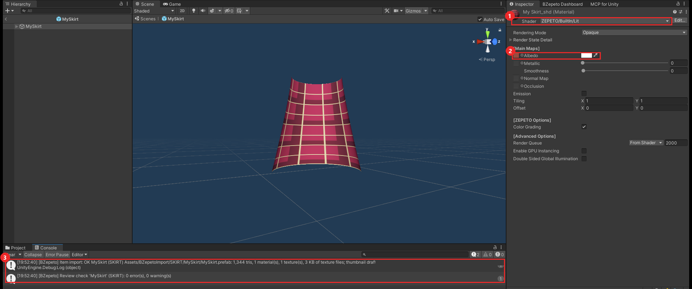
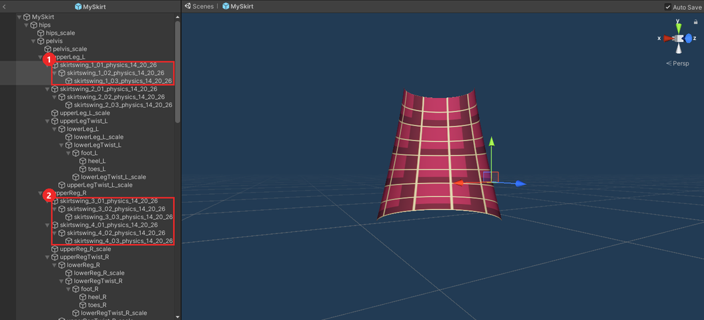
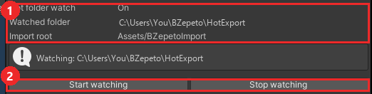

# Unity 패키지 (ZEPETO Studio)

[🇺🇸 English](./unity.md) | 🇰🇷 한국어

## 1. 설치

1. ZEPETO Studio 프로젝트(**Unity 2020.3.9f1**)를 엽니다
2. **Window > Package Manager**, 왼쪽 위 **+** 를 눌러 **Add package from tarball...**
3. `com.bzepeto.unity2020-<버전>.tgz` 를 고릅니다
4. 메뉴 막대에 **BZepeto** 메뉴가 생기고, Console에 `[BZepeto] Hot folder watch started` 가 나옵니다

업데이트도 새 파일로 똑같이 하면 이전 버전이 교체됩니다.

## 2. 자동으로 되는 것

- **Blender에서 보낸 아이템**(Send to Unity)은 `Assets/BZepetoImport/<카테고리>/<아이템>/` 에 FBX,
  프리팹, 텍스처로 들어옵니다
- **제페토 셰이더가 자동으로 지정**되고(Blender에서 고른 셰이더, 없으면 이름으로 추측), 모든 맵이 알맞은
  슬롯에 올바른 색 공간·키워드·계수로 연결됩니다(노멀 맵, 메탈릭/스무스니스, 발광, 광택, 털, 헤어,
  무지갯빛, 클리어코트, 툰 맵, CustomEnv 큐브맵). 알파가 있는 텍스처는 Cutout 모드(레이스)
- 헤드웨어·마스크 재질 이름에 **(NoColor)** 가 붙어 머리색이 섞이지 않습니다
- **Import BlendShapes** 가 켜져 얼굴 표정이 그대로 들어옵니다
- 텍스처 총 **1MB** 를 다시 검사하고, **썸네일 초안**(300×300 투명 PNG)을 `<프로젝트>/BZepetoThumbnails`
  에 저장합니다
- **ArmorPaint에서 보낸 텍스처**도 아이템 옆으로 복사되어 같은 방식으로 연결됩니다
- **세트 의상**(상의·하의 재질, UDIM 타일): `<아이템>.udim.json` 이 어느 텍스처가 어느 재질 것인지 알려
  주어, 재질마다 자기 맵이 연결됩니다

Unity 창이 앞에 있지 않아도 됩니다 — 백그라운드에서 계속 가져옵니다.

Blender 에서 보낸 치마가 들어온 모습: **①** 제페토 셰이더(`ZEPETO/BuiltIn/Lit`)가 지정되고 **②** 텍스처가 Albedo 칸에
연결됩니다. **③** Console 에 가져오기 결과와 심사 검사 결과(`0 error(s), 0 warning(s)`)가 나옵니다.

**흔들림 뼈** — Blender 의 Auto Skirt Swing 으로 만든 체인은 이름 그대로(`skirtswing_1_01_physics_14_20_26`)
허벅지 뼈 아래에 들어옵니다 **①②**. 제페토는 이름에 `_physics` 가 있는 뼈를 흔듭니다.

## 3. BZepeto 메뉴

| 메뉴 | 하는 일 |
|---|---|
| **BZepeto > Open Dashboard** | 브리지, 핫 폴더, 가져오기 상태 |
| **BZepeto > Bridge Connection** | Blender와 직접 연결 |
| **BZepeto > Review > Check Selected Prefab** | 선택한 프리팹 심사 검사: 조명(Light), 파티클 한도, 재질·텍스처 없는 파티클(업로드하면 흰 네모), 제페토가 아닌 셰이더, Color Grading, 털 길이, "(NoColor)", Import BlendShapes. 결과는 Console에 |
| **BZepeto > Review > Make Thumbnail (Selected Prefab)** | 썸네일 초안. 파티클은 1초 재생한 뒤 찍어서 보입니다 |
| **BZepeto > Review > URP Readiness (Selected)** | 모든 재질이 제페토 BuiltIn 셰이더인지 (제페토가 URP로 바꿀 때 자동 변환되는 셰이더) |
| **BZepeto > Effects > Add Safe Particle System** | 선택한 fx 조인트에 이펙트 가이드 한도 안의 파티클 시스템 추가 |
| **BZepeto > Effects > Set Selected Textures as Particle Sprites** | 이펙트 가이드대로 Sprite(2D and UI) + Full Rect |
| **BZepeto > Capture Playground For Blender** | 플레이그라운드 씬 Play 모드에서: Blender 플레이그라운드와 뚫림 검사용 제페토 미리보기 메뉴 기록 |
| **BZepeto > Convert Diagnostics** | "Convert to ZEPETO style" 이 실패한 이유 |

**BZepeto > Open Dashboard** 의 **Import** 탭: 핫 폴더 감시 상태와 감시하는 폴더 **①**, 감시 켜기·끄기 **②**.

