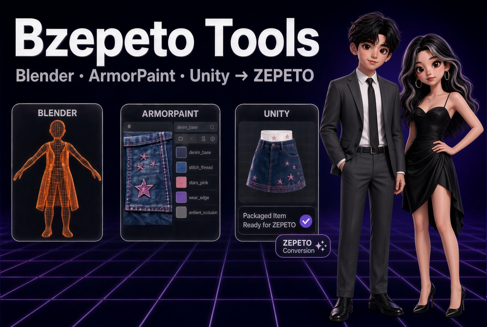

# BZepeto — ZEPETO Item Creator Suite for Blender, Unity & ArmorPaint

🇺🇸 English | [🇰🇷 한국어](./KO_index.md)

> BZepeto is an independent tool made by Chamiseul (ChamIseul Creator). It is not made,
> endorsed or supported by NAVER Z (ZEPETO), the Blender Foundation, Unity Technologies or
> the ArmorPaint authors.



## What's New

**v1.0.0 — First release**

- Blender add-on: ZEPETO checks and Send, swing bone wizard, body shape, wearables, playground
- ArmorPaint live link: paint while you model, smart ZEPETO materials, automatic stitches
- Unity package for ZEPETO Studio (Unity 2020.3.9): hot folder import and automatic ZEPETO shaders

---

## What is BZepeto?

The whole route of a ZEPETO item in one place: build it in Blender, paint it in ArmorPaint,
and hand it to ZEPETO Studio in Unity — without exporting, importing and wiring materials
by hand at every step.

```
Blender  ──①──>  ArmorPaint  ──②──>  Blender
   │                  └────③────>  Unity (ZEPETO Studio)
   └──────────────④──────────────>  Unity (ZEPETO Studio)
```

① the mesh goes to ArmorPaint live ② painted textures come back ③ textures go straight to
Unity ④ the finished item goes to Unity, checked and packaged

---

## What you need

| | |
|---|---|
| OS | Windows 10 / 11, 64-bit |
| Blender | 4.2 or later (tested on 5.0) |
| Unity | ZEPETO Studio project, **Unity 2020.3.9f1** |
| GPU | DirectX 12 capable (for ArmorPaint) |
| ZEPETO base character | `creatorBaseSet_zepeto.fbx` from ZEPETO's creator resources — it is ZEPETO's file, so it is **not included** |

---

## Installing

Your download has these files:

| File | What it is |
|---|---|
| `bzepeto_blender.zip` | Blender add-on |
| `com.bzepeto.unity2020-<version>.tgz` | Unity package for **ZEPETO Studio (Unity 2020.3.9)** — use this one |
| `com.bzepeto.unity-<version>.tgz` | Unity package for Unity 6 / 2022.3 (for when ZEPETO moves to Unity 6) |
| `BZepeto_ArmorPaint_<version>_win64.zip` | ArmorPaint build with the BZepeto plugins already enabled |

### 1. Blender

1. **Edit > Preferences > Add-ons**, click **▼** at the top right, **Install from Disk**
2. Pick `bzepeto_blender.zip`
3. Press **N** in the 3D viewport — the **BZepeto** tab appears

### 2. ArmorPaint

1. Unzip `BZepeto_ArmorPaint_<version>_win64.zip` anywhere, e.g. `C:\Tools\BZepeto_ArmorPaint`
   (avoid *Program Files* — ArmorPaint cannot save its settings there)
2. Run `ArmorPaint.exe` once to check the window opens
3. In Blender, **Edit > Preferences > Add-ons > BZepeto**, set **ArmorPaint Executable** to
   that `ArmorPaint.exe`

> Why a whole ArmorPaint build and not just a plugin? The live link needs a small change to
> ArmorPaint itself: a normal ArmorPaint stops updating the moment you click back into
> Blender. The build is compiled from ArmorPaint's zlib-licensed source, and every change is
> marked in the source.

### 3. Unity (ZEPETO Studio)

1. Open your ZEPETO Studio project
2. **Window > Package Manager**, click **+**, **Add package from tarball...**
3. Pick `com.bzepeto.unity2020-<version>.tgz`
4. A **BZepeto** menu appears at the top

### 4. The base character

Put `creatorBaseSet_zepeto.fbx` into `%USERPROFILE%\BZepeto\Samples\`, or point
**Base Character FBX** in the add-on preferences at wherever you keep it.

### Where BZepeto keeps its files

Everything lives under `%USERPROFILE%\BZepeto`. Blender and Unity both use
`%USERPROFILE%\BZepeto\HotExport` as the hand-over folder, so there is nothing to set up
between them. To move everything somewhere else, set the environment variable
`BZEPETO_HOME` (e.g. `D:\BZepeto`) and restart Blender and Unity.

---

## 1. Blender — the BZepeto tab

### Rigging
- **Bone counter** — compares your rig with ZEPETO's 104-bone base skeleton and counts the
  swing bones you added
- **Pose** — switch between T-pose and A-pose. The rig shows which pose it is in, and going
  back restores the saved rig instead of rotating again, so the shoulders do not drift
  after repeated switches
- **Weights** — transfer, mirror, limit to 4 influences
- **Bone Cleaner** — remove unused bones

### Swing bones (hair, skirts, ribbons)
1. In Edit Mode, **select the edge runs** the chains should follow (four vertical runs on a
   skirt = four chains)
2. The panel tells you what it will build before anything is created: *"4 chain(s), 12 bone(s)"*
3. Choose bones per chain (a fixed count or one per edge), a preset (hair, ribbon, skirt,
   coat, accessory), the bone to hang from and the weight radius
4. **Make Swing Chains**

Bones are named the way ZEPETO reads them: `<joint> physics <drag> <angle drag> <restore drag>`.
ZEPETO recommends 2–5 chains per item. **Remove Physics Naming** strips the physics part of
the names again.

### Body shape
Eight sliders — height, shoulder width, chest, waist, pelvis, leg length, neck, head size —
with **Realtime** to see the character change while you drag. Leg length moves the bones the
way the ZEPETO SDK does, so the feet stay on the ground.

### Wearables
`Import Clothing` → `Align Mesh to Base Body` → `Make Garment Rig` →
`Bind Garment To Character` → `Refit Clothing To Body`

### Send to ZEPETO
Checks the item against the limits of its category — 13 checks including triangles,
materials, texture size (512 px), UVs, bone influences, transforms and names. A failed check
comes with the button that fixes it (**Fix Transforms**, **Create ZEPETO Material**). When
everything passes, the item goes to Unity as a package.

### ZEPETO Playground
ZEPETO Studio's play-mode menu rebuilt in Blender: 10 animations, camera, body types, the
13 SDK deformations and the space — so you can check the item before it ever reaches Unity.

> The playground needs a capture from your own ZEPETO Studio project once: in Unity, enter
> Play mode in the playground scene and choose **BZepeto > Capture Playground For Blender**.

---

## 2. ArmorPaint

### Paint while you model
1. Select the item mesh in Blender and press **Paint in ArmorPaint**
2. ArmorPaint opens with the item; its panel reads **BZepeto Live Link: CONNECTED**
3. With **Auto Push** on, your edits in Blender are sent again 0.8 s after you stop — the
   paint layers stay

An item without a material gets a ZEPETO-ready one on the way out.

### ZEPETO smart materials
The **BZepeto Materials** panel in ArmorPaint: **Denim, Cotton, Knit, Leather, Metal, Base**.
They are procedural, so they stay crisp when ZEPETO shrinks textures to 512 px, and they
already match ZEPETO's texture channels. Press one, then **Fill Layer With It**, and paint on
top.

### Stitches
1. In Blender Edit Mode, select the seam edges
2. Press **Stitch Selected Edges** — it shows *"Will draw: N seam(s), M stitch(es)"* first
3. The stitches appear in ArmorPaint as their **own layer**, so you can recolour or erase
   them like anything else

| Setting | |
|---|---|
| Dash / Gap / Width | thread length, spacing and thickness in millimetres of the real item |
| Color / Roughness | thread colour and roughness |
| Target | `ArmorPaint` (a layer, recommended) or `Blender` (drawn on the material) |

A seam on the border of two UV islands is stitched on **both** pieces, like real clothing.

### Sending the textures

| Button in ArmorPaint | |
|---|---|
| **Send to Blender** | Blender picks the textures up by itself (**Auto Receive**) |
| **Send to Unity** | goes straight into your ZEPETO Studio project |
| **Send to Both** | both |
| **Size 512 / 1024 / 2048 / 4096** | size of the delivered textures — you keep painting at full resolution |

> ZEPETO allows 512 px textures and 1 MB per item, which is why 512 is the default.

---

## 3. Unity (ZEPETO Studio)

Everything happens by itself once the package is installed:

- **Items from Blender** land in `Assets/BZepetoImport/<CATEGORY>/<item>/` as FBX, prefab and
  textures
- **ZEPETO shaders are applied** automatically (e.g. `ZEPETO/BuiltIn/Cloth`) and the textures
  go into the right slots — base colour, normal map and metallic/smoothness
- **Textures from ArmorPaint** are copied next to the item and hooked up the same way

Unity does not need to be the active window — it keeps importing in the background.

---

## Troubleshooting

| Symptom | Fix |
|---|---|
| ArmorPaint panel says `WAITING FOR BLENDER` | Nothing has been sent yet — press **Paint in ArmorPaint** in Blender |
| "Set the ArmorPaint path in the add-on preferences first" | Set **ArmorPaint Executable** (Installing, step 2) |
| Textures never reach Blender | Check the ArmorPaint panel says `CONNECTED` and **Auto Receive** is on in Blender |
| Several ArmorPaint windows | Each press of **Paint in ArmorPaint** starts one — close them all and press once |
| A pose button is greyed out | The rig is already in that pose |
| Send fails with "No material" | Press **Create ZEPETO Material** |
| Nothing arrives in Unity | Check the Unity Console for `[BZepeto] Hot folder watch started` and that you installed the **2020** package |
| Playground list is empty | Make a capture once (see *ZEPETO Playground*) |

---

## Licence

- Blender add-on — GNU GPL v3 or later
- Unity package and ArmorPaint plugins — BZepeto EULA (one licence per person; what you make
  is yours; do not share or resell the tools)
- ArmorPaint build — zlib licence, © the ArmorPaint authors; fonts and other components under
  their own licences (see the files in the download)

© 2026 Chamiseul
